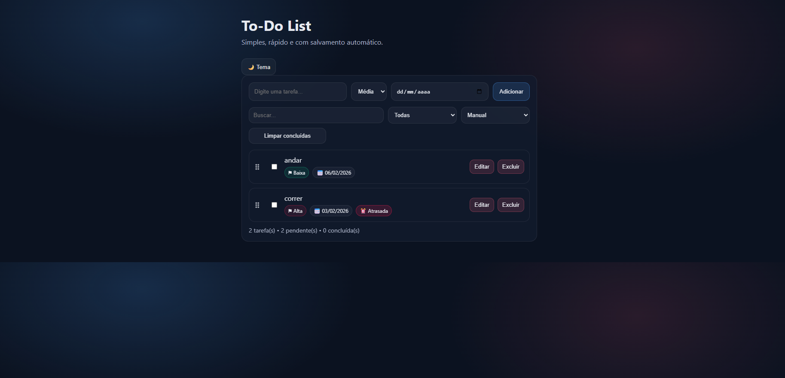
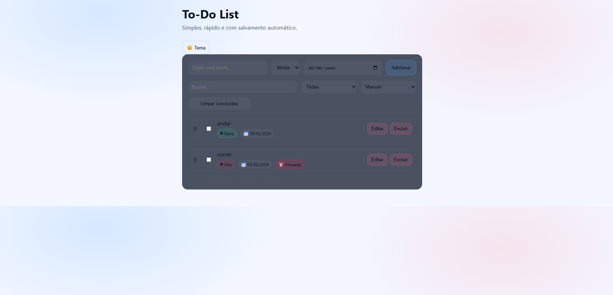

# ✅ To-Do List (HTML, CSS, JavaScript)

Aplicação de lista de tarefas com foco em UX e funcionalidades de produto: prioridade, data limite, ordenação, tema e persistência local.

## 📸 Preview

| Tema escuro | Tema claro |
|---|---|
|  |  |

## ✨ Funcionalidades

- Adicionar, concluir e excluir tarefas
- Edição inline
- Persistência com localStorage
- Prioridade: Alta / Média / Baixa
- Data limite opcional
- Indicador de tarefa ⏰ atrasada
- Ordenação: manual (drag & drop), prioridade, data e criação
- Busca e filtro
- Tema claro/escuro com salvamento

## 🧱 Tecnologias

- HTML5
- CSS3
- JavaScript (DOM + localStorage)

## ▶️ Como rodar

Abra `index.html` no navegador  
ou use Live Server no VSCode

## 📁 Estrutura

todo-list/
assets/
index.html
style.css
script.js
README.md

---

Feito por **Rafael Bonin**
